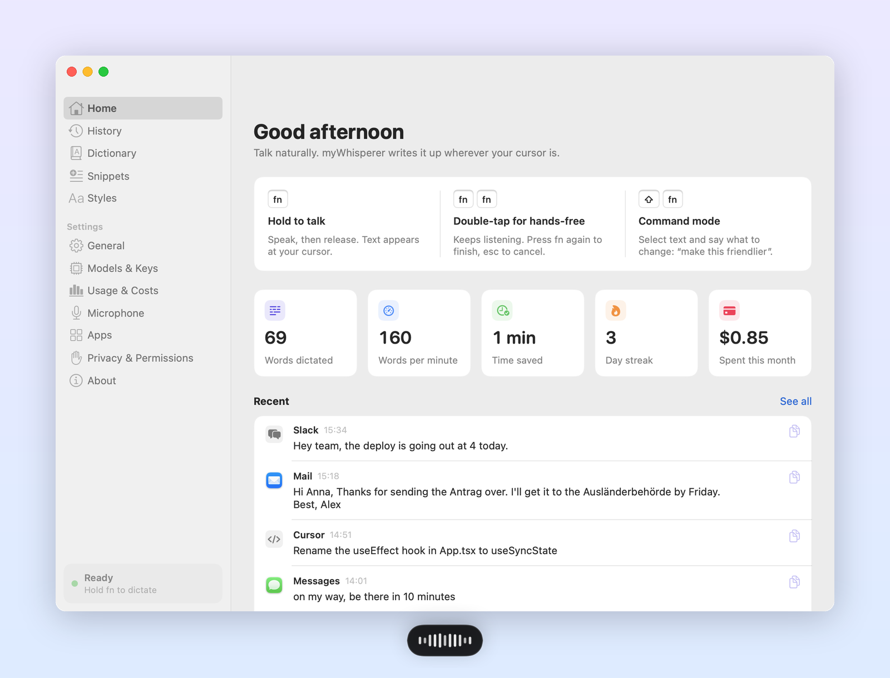
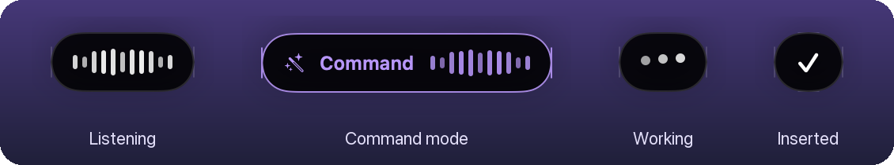
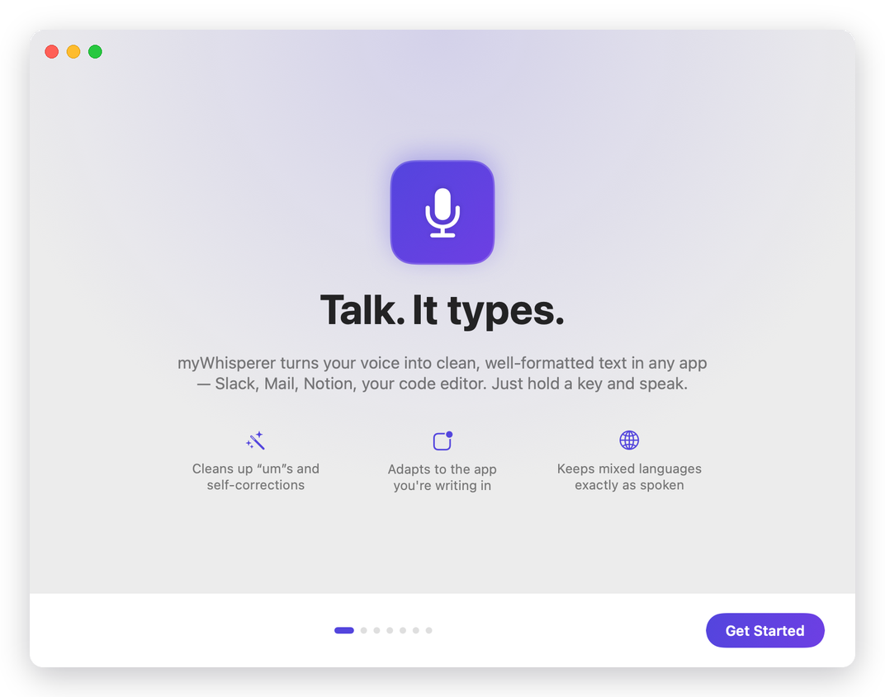
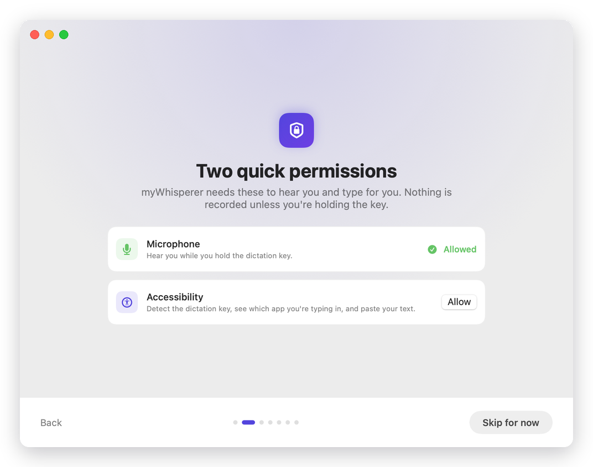
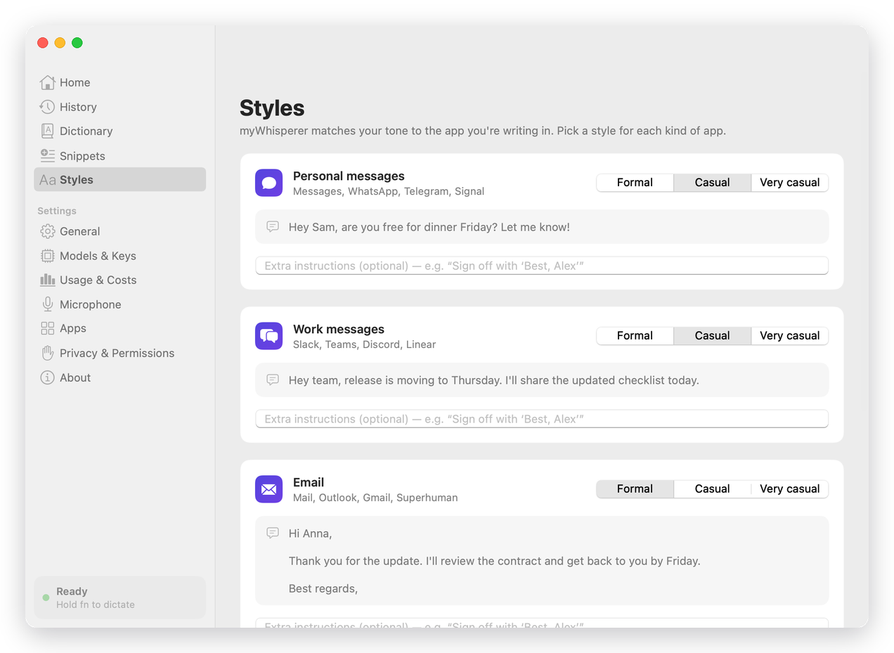
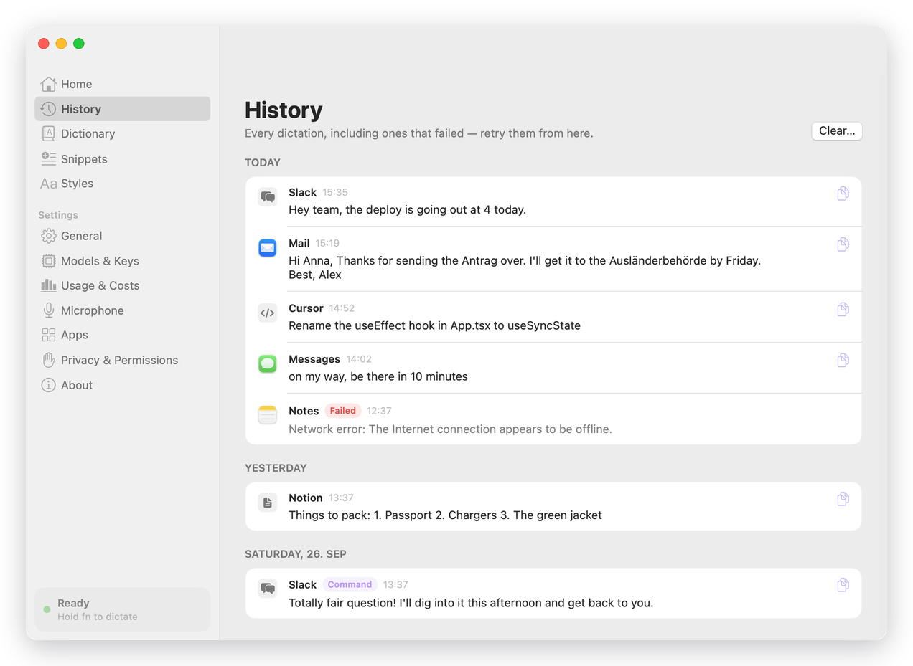
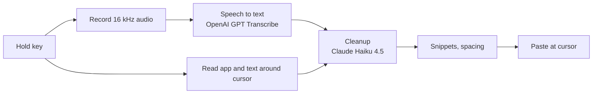
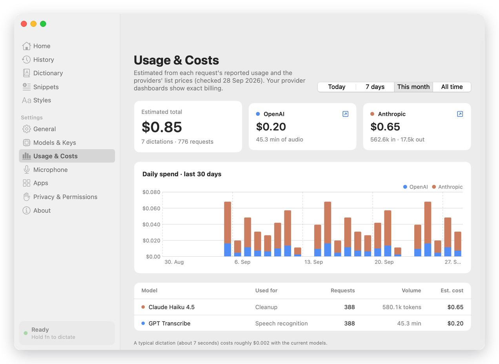

<div align="center">



# myWhisperer

**Open-source voice dictation for macOS. Hold a key, talk, and clean, well-formatted text appears in whatever app you're typing in.**

[](https://github.com/KunalGehlot/myWhisperer/actions/workflows/ci.yml)


[](LICENSE)

</div>

---

myWhisperer is a free, open-source, native menu-bar app: an alternative to subscription dictation tools like Wispr Flow. It runs on your own API keys, so you pay the providers directly (about **$0.002 per dictation**), with no subscription, no account, and no telemetry.

- **Works everywhere.** Slack, Mail, Notion, your browser, Xcode, VS Code, Cursor, the terminal: text goes wherever your cursor is.
- **Cleans up as you talk.** It removes "um"s and "you know"s. It applies your corrections ("Tuesday, no wait, Wednesday" becomes "Wednesday"), adds punctuation, and turns spoken lists into real lists.
- **Knows where you are.** Tone and formatting adapt to the app: casual in chat, properly laid out in email, identifier-safe in code. It also reads the text around your cursor, so it continues your sentence instead of restarting it.
- **Keeps your languages.** Drop German words (or any language's) into an English sentence and they come out exactly as you said them, never translated.
- **Command mode.** Select text, hold <kbd>⇧</kbd> + your key, and say "make this friendlier" or "turn this into bullet points".
- **Never loses a word.** Every dictation lands in a searchable history, and failed ones can be retried from the saved audio.

<div align="center">

</div>

## Contents

- [Requirements](#requirements)
- [Install](#install)
- [First run](#first-run)
- [Using myWhisperer](#using-mywhisperer)
- [Models, keys, and cost](#models-keys-and-cost)
- [Privacy](#privacy)
- [Troubleshooting](#troubleshooting)
- [Development](#development)
- [Roadmap](#roadmap)

## Requirements

| | |
|---|---|
| **macOS** | 14 Sonoma or later (Apple silicon or Intel) |
| **Xcode** | 16 or later, the full Xcode app from the App Store, not just the Command Line Tools |
| **API keys** | [OpenAI](https://platform.openai.com/api-keys) (required, speech recognition) and [Anthropic](https://console.anthropic.com/settings/keys) (recommended, cleanup) |

## Install

The native app is built from source for now; signed downloads are on the roadmap.

```bash
git clone https://github.com/KunalGehlot/myWhisperer.git
cd myWhisperer
scripts/bundle.sh                       # builds, signs, installs ~/Applications/myWhisperer.app
open ~/Applications/myWhisperer.app
```

> [!NOTE]
> **On Windows or Linux?** Versions up to 0.2.3 were a cross-platform Electron app. Its installers are still on the [v0.2.3 release](https://github.com/KunalGehlot/myWhisperer/releases/tag/v0.2.3). From 0.3.0, myWhisperer is a native macOS app.

A waveform icon appears in your menu bar and the welcome guide opens.

> [!TIP]
> **Sign with a free Apple Development certificate** so macOS keeps your permission grants when you rebuild. Without one, the app is signed ad hoc and macOS asks for Accessibility again after every build.
>
> 1. Open Xcode → **Settings → Accounts** and add your Apple ID. A free account works.
> 2. Select your team → **Manage Certificates… → + → Apple Development**.
> 3. Check it shows up with `security find-identity -v -p codesigning`. If it says *0 valid identities*, install Apple's [WWDR G3 intermediate certificate](https://www.apple.com/certificateauthority/AppleWWDRCAG3.cer) by double-clicking it.
>
> `scripts/bundle.sh` picks the certificate up automatically. To force one, set `SIGN_IDENTITY`.

<details>
<summary>First time using Xcode on this Mac?</summary>

Accept the license once, or `swift` refuses to run:

```bash
sudo xcodebuild -license accept
```

</details>

## First run

The welcome guide walks through everything in about a minute:

| | |
|---|---|
|  |  |

1. **Permissions.** myWhisperer needs two. Their status updates live as you grant them.
   - **Microphone**, to hear you while you hold the key.
   - **Accessibility**, to detect the key, see which app you're in, and paste text.
2. **API keys.** Paste your OpenAI and Anthropic keys. Each one is checked with a real request and stored in your macOS Keychain.
3. **Microphone check.** Pick an input and watch the meter move.
4. **Hotkey.** <kbd>fn</kbd> (Globe) by default, or right <kbd>⌥</kbd>, right <kbd>⌘</kbd>, or right <kbd>⌃</kbd>.
5. **Try it** in a practice box.

> [!IMPORTANT]
> If you use <kbd>fn</kbd>, set **System Settings → Keyboard → "Press 🌐 key to" → Do Nothing**. Otherwise macOS opens the emoji picker or switches keyboard layout every time you dictate.

## Using myWhisperer

| Shortcut | What it does |
|---|---|
| Hold <kbd>fn</kbd> | Talk while holding; text is inserted when you let go |
| Double-tap <kbd>fn</kbd> | Hands-free: keeps listening until you press <kbd>fn</kbd> again |
| <kbd>Space</kbd> while holding <kbd>fn</kbd> | Also switches to hands-free |
| <kbd>esc</kbd> | Cancel while listening or processing |
| <kbd>⇧</kbd> + <kbd>fn</kbd> | **Command mode**: select text first, then say how to change it |
| <kbd>⌃</kbd> <kbd>⌘</kbd> <kbd>V</kbd> | Paste your last dictation again |

A small pill at the bottom of the screen shows what's happening. It never takes focus, so your text always lands where you were typing.

**Styles.** myWhisperer sorts apps into *personal messages*, *work messages*, *email*, *code*, and *everything else*. Each gets a tone (formal, casual, very casual) and optional instructions of your own, such as "sign emails with 'Best, Alex'". Per-app rules under **Settings → Apps** can switch cleanup off, insert raw text, or turn dictation off entirely for a given app.

**Dictionary and snippets.** Add names, jargon, and foreign words to the **Dictionary** so they're always spelled right. **Snippets** expand a spoken cue into stored text: say "my calendar link" and get your full URL. Snippets are matched exactly, never guessed by the AI.

| | |
|---|---|
|  |  |

## Models, keys, and cost

Each dictation makes two requests:



| Step | Default | Alternatives (Settings → Models & Keys) |
|---|---|---|
| Speech to text | `gpt-transcribe` | `whisper-1`, `gpt-4o-transcribe`, `gpt-4o-mini-transcribe` |
| Cleanup | `claude-haiku-4-5` | `claude-sonnet-5`, `claude-opus-5`, OpenAI `gpt-6-luna`, or off (raw text) |

- **Languages.** Tell myWhisperer every language you speak, even just a few words of one. The default is English + German. Recognition is steered by these languages and by your dictionary, and nothing is ever translated.
- **Speed.** Text usually appears about **1.5–1.8 s** after you release the key. If cleanup takes longer than the configured wait, the raw transcript is inserted instead, so you're never stuck.
- **Cost.** At list prices a typical 7-second dictation costs about $0.002. **Settings → Usage & Costs** tracks estimated spend per provider and model, with a 30-day chart.
  - These are estimates. Your provider dashboards show exact billing.
  - Prices were last checked on 28 Sep 2026 and are kept in [`Usage.swift`](Sources/MyWhispererCore/Models/Usage.swift).

<div align="center">

</div>

## Privacy

- **Audio** is recorded only while you hold the key (or in hands-free mode), and is sent to OpenAI for transcription.
- **Text** is sent to your cleanup provider: the transcript, the app's name and window title, the website's domain, and up to about 1,500 characters before and 300 after your cursor (plus any selection). Password fields are never read. Turn off **Privacy → Use the text around your cursor** to send only the transcript.
- **API keys** live in your macOS Keychain.
- **History, dictionary, snippets, and usage** stay on your Mac in `~/Library/Application Support/myWhisperer`. Set a retention period or delete everything from **Privacy & Permissions**.
- No analytics and no telemetry. Nothing is sent anywhere except to the two providers you configured.

## Troubleshooting

<details>
<summary><b>Holding fn opens the emoji picker or switches input source</b></summary>

System Settings → Keyboard → **Press 🌐 key to** → **Do Nothing**.
</details>

<details>
<summary><b>Double-tapping fn also starts Apple's Dictation</b></summary>

System Settings → Keyboard → Dictation → **Shortcut**: choose anything other than "Press 🌐 twice", or turn Dictation off.
</details>

<details>
<summary><b>The hotkey doesn't do anything</b></summary>

- Check that the menu-bar icon doesn't show a warning badge, and look at **Settings → Privacy & Permissions**.
- After granting Accessibility, macOS sometimes needs the app restarted before it passes keys through. Use the **Relaunch** button there.
- If you rebuilt without a signing certificate, reset the stale grant and approve it again:
  `tccutil reset Accessibility com.mywhisperer.app`.
- Apps that turn on **Secure Keyboard Entry**, such as Terminal (Terminal → Secure Keyboard Entry) and some password managers, block all global hotkeys while they're in front.
</details>

<details>
<summary><b>Nothing gets typed</b></summary>

If no text field is focused, myWhisperer puts the text on your clipboard instead and says so; press <kbd>⌘</kbd><kbd>V</kbd> where you want it. Every dictation is also saved in **History**, and <kbd>⌃</kbd><kbd>⌘</kbd><kbd>V</kbd> pastes the last one again, so nothing is lost.
</details>

<details>
<summary><b>The first word gets cut off, or quality is poor with AirPods</b></summary>

Bluetooth headsets switch to a low-quality mode while their microphone is in use, and take longer to start. Choose your Mac's built-in microphone under **Settings → Microphone** (or from the menu-bar icon).
</details>

## Development

```
Sources/MyWhispererCore/   UI-free logic: prompts, providers, pipeline, dictation state machine (Swift 6)
Sources/MyWhisperer/       AppKit/SwiftUI app: hotkey tap, audio, Accessibility, HUD, windows
Tests/MyWhispererCoreTests Unit tests (Swift Testing), run with `swift test`
scripts/bundle.sh       Build, sign, and install the .app
scripts/eval/eval.py    Live evaluation against real APIs
```

```bash
swift build && swift test            # build and run the unit tests
scripts/bundle.sh [debug|release]    # install ~/Applications/myWhisperer.app
```

The app binary has a few developer entry points that make UI and prompt work possible without clicking around:

| Command | Purpose |
|---|---|
| `myWhisperer --snapshot <screen\|all> <out> [--dark]` | Render any screen offscreen to PNG with sample data (the screenshots in this README come from it) |
| `myWhisperer --dictate-file clip.wav [--app com.apple.mail] [--before "text"] [--command --selected "text"]` | Run the full pipeline on an audio file and print raw/final text, per-stage latency, and cost |
| `scripts/eval/eval.py [filter…] [--stt m] [--refiner m]` | Generate spoken test clips with macOS voices (including mixed English/German) and run them all. Uses real API calls and costs a few cents |
| `open "mywhisperer://state"` | Write the running app's state to `~/Library/Application Support/myWhisperer/state.json` |
| `open "mywhisperer://hud?state=recording"` | Preview any HUD state on screen |

The binary lives at `~/Applications/myWhisperer.app/Contents/MacOS/myWhisperer`. Running the installed, signed copy lets it read your saved keys without Keychain prompts. `OPENAI_API_KEY` / `ANTHROPIC_API_KEY` also work.

To log what the hotkey sees:

```bash
defaults write com.mywhisperer.app DebugHotkey -bool true
log stream --predicate 'process == "myWhisperer"'
```

Contributions are welcome. Please run `swift test` before opening a pull request. If you change prompts, also run `scripts/eval/eval.py` and include the before/after output.

## Roadmap

- [x] Hold-to-talk, hands-free, and command mode
- [x] Context-aware cleanup with per-app styles, dictionary, and snippets
- [x] History with retry, usage and cost tracking
- [ ] Lower latency: pre-warm connections while you speak, stream transcription
- [ ] On-device speech recognition (WhisperKit) for offline and private use
- [ ] Learn dictionary words from your corrections
- [ ] Signed and notarized downloadable releases

## History

- **0.1–0.2 (Electron).** A cross-platform app for macOS, Windows, and Linux, using OpenAI Whisper and GPT.
- **0.3 (native).** A native Swift rewrite for macOS. It adds real app context (via Accessibility), rewritten cleanup prompts, faster models, a new interface, command mode, snippets, and usage tracking.

See the [changelog](CHANGELOG.md) for details.

## License

[MIT](LICENSE) © Kunal Gehlot

myWhisperer is an independent open-source project and is not affiliated with Wispr, OpenAI, or Anthropic.
